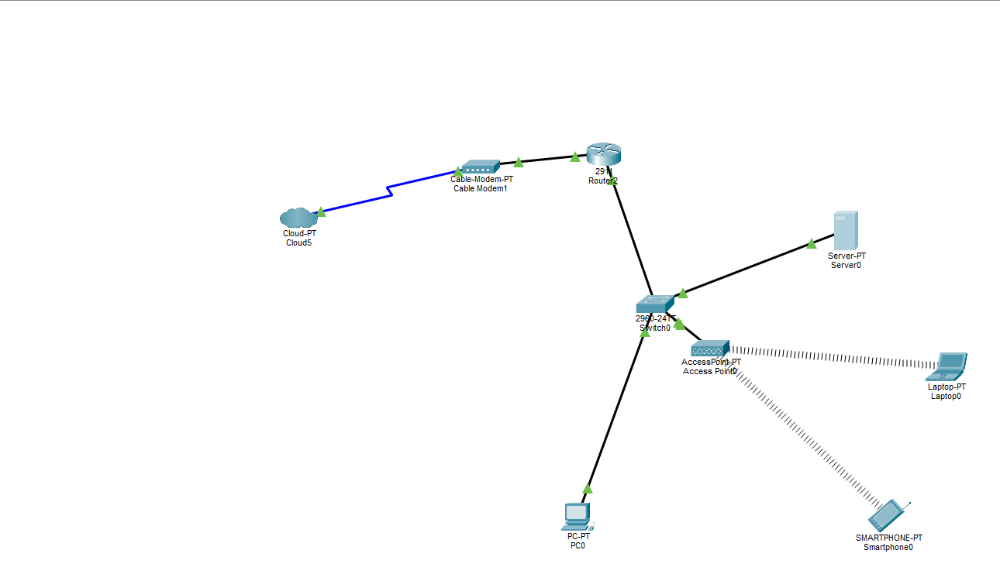
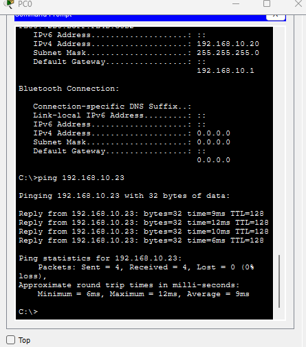

# 🏠 Rede Local (LAN) Residencial — Mini Projeto

Simulação de uma rede local (LAN) para um quarto, com conexão cabeada e sem fio, desenvolvida no **Cisco Packet Tracer**.

O projeto integra modem, roteador, switch e access point, distribuindo internet e conectividade interna para um PC, um notebook, um smartphone e um servidor local — tudo sob a mesma faixa de IP e o mesmo gateway.

---

## 📌 Objetivo

Aplicar, na prática, conceitos de:

- Endereçamento IP estático
- Configuração de roteador via **CLI**
- Distribuição de rede cabeada (switch) e sem fio (access point)
- Testes de conectividade entre hosts

---

## 🗺️ Topologia da rede



**Fluxo de conexão:**

```
Cloud5 (Internet/Operadora)
   │  (link WAN)
Cable Modem1
   │  (cabo de cobre)
Router2  — GigabitEthernet 0/0 (WAN) ──── GigabitEthernet 0/1 (LAN, gateway 192.168.10.1)
                                                  │
                                              Switch0 (2960-24TT)
                                      ┌───────────┼───────────┐
                                    Server0     PC0      AccessPoint0
                                                            │
                                                   ┌────────┴────────┐
                                                Laptop0          Smartphone0
                                               (Wi-Fi)             (Wi-Fi)
```

| Origem | Destino | Meio |
|---|---|---|
| Cloud5 | Cable Modem1 | Link WAN (operadora) |
| Cable Modem1 | Router2 (Gi0/0) | Cabo de cobre (Ethernet) |
| Router2 (Gi0/1) | Switch0 | Cabo de cobre (Ethernet) |
| Switch0 | Server0 | Cabo de cobre (Ethernet) |
| Switch0 | PC0 | Cabo de cobre (Ethernet) |
| Switch0 | AccessPoint0 | Cabo de cobre (Ethernet) |
| AccessPoint0 | Laptop0 / Smartphone0 | Wi-Fi |

---

## 🖥️ Equipamentos utilizados

| Dispositivo | Modelo (Packet Tracer) | Função na rede |
|---|---|---|
| Cloud5 | Cloud-PT | Simula a conexão com a internet/operadora |
| Cable Modem1 | Cable-Modem-PT | Converte o sinal da operadora para Ethernet |
| Router2 | Cisco 2911 | Roteamento e gateway da rede local |
| Switch0 | Cisco 2960-24TT | Distribuição da conexão cabeada |
| Access Point0 | AccessPoint-PT | Distribuição da conexão sem fio (Wi-Fi) |
| PC0 | PC-PT | Estação de trabalho cabeada |
| Laptop0 | Laptop-PT | Notebook conectado via Wi-Fi |
| Smartphone0 | Smartphone-PT | Dispositivo móvel conectado via Wi-Fi |
| Server0 | Server-PT | Servidor local da rede |

---

## 🌐 Plano de endereçamento IP

- **Rede:** `192.168.10.0/24`
- **Máscara:** `255.255.255.0`
- **Gateway padrão:** `192.168.10.1`

Todos os dispositivos foram configurados com **IP estático** e o mesmo gateway.

| Dispositivo | Endereço IP | Máscara | Gateway |
|---|---|---|---|
| Router2 (Gi0/1) | `192.168.10.1` | `255.255.255.0` | — |
| PC0 | `192.168.10.20` | `255.255.255.0` | `192.168.10.1` |
| Laptop0 | `192.168.10.22` | `255.255.255.0` | `192.168.10.1` |
| Smartphone0 | `192.168.10.23` | `255.255.255.0` | `192.168.10.1` |
| Server0 | `192.168.10.25` | `255.255.255.0` | `192.168.10.1` |

---

## ⚙️ Configuração do roteador (via CLI)

O `Router2` foi configurado inteiramente pela interface de linha de comando.

### Interfaces

| Interface | Conectado a | Endereço IP | Observação |
|---|---|---|---|
| GigabitEthernet 0/0 | Cable Modem1 | Obtido via operadora / WAN | Link com a internet |
| GigabitEthernet 0/1 | Switch0 | `192.168.10.1 / 255.255.255.0` | Gateway da LAN |

### Comandos

```bash
Router> enable
Router# configure terminal
Router(config)# hostname Router2

# Interface conectada ao modem (saída para internet)
Router2(config)# interface GigabitEthernet0/0
Router2(config-if)# ip address dhcp
Router2(config-if)# no shutdown
Router2(config-if)# exit

# Interface conectada ao switch (rede interna / gateway)
Router2(config)# interface GigabitEthernet0/1
Router2(config-if)# ip address 192.168.10.1 255.255.255.0
Router2(config-if)# no shutdown
Router2(config-if)# exit

Router2(config)# end
Router2# copy running-config startup-config
```

> A interface `Gi0/0` pode receber IP estático fornecido pela operadora ou via DHCP, dependendo do que o `Cloud-PT` estiver simulando.

---

## ✅ Testes de conectividade

Ping do **PC0** (`192.168.10.20`) para o **Smartphone0** (`192.168.10.23`), validando a comunicação entre a rede cabeada e a rede sem fio:

```
C:\>ping 192.168.10.23

Pinging 192.168.10.23 with 32 bytes of data:

Reply from 192.168.10.23: bytes=32 time=9ms TTL=128
Reply from 192.168.10.23: bytes=32 time=12ms TTL=128
Reply from 192.168.10.23: bytes=32 time=10ms TTL=128
Reply from 192.168.10.23: bytes=32 time=6ms TTL=128

Ping statistics for 192.168.10.23:
    Packets: Sent = 4, Received = 4, Lost = 0 (0% loss),
Approximate round trip times in milli-seconds:
    Minimum = 6ms, Maximum = 12ms, Average = 9ms
```



**Resultado:** 4 de 4 pacotes recebidos, 0% de perda — comunicação entre a rede cabeada e a rede sem fio validada com sucesso. ✅

---

## 📥 Arquivo da simulação

O arquivo original da simulação está disponível em [`Projeto.pkt`](./Projeto.pkt).
## 🧰 Ferramenta utilizada

- [Cisco Packet Tracer](https://www.netacad.com/courses/packet-tracer)
